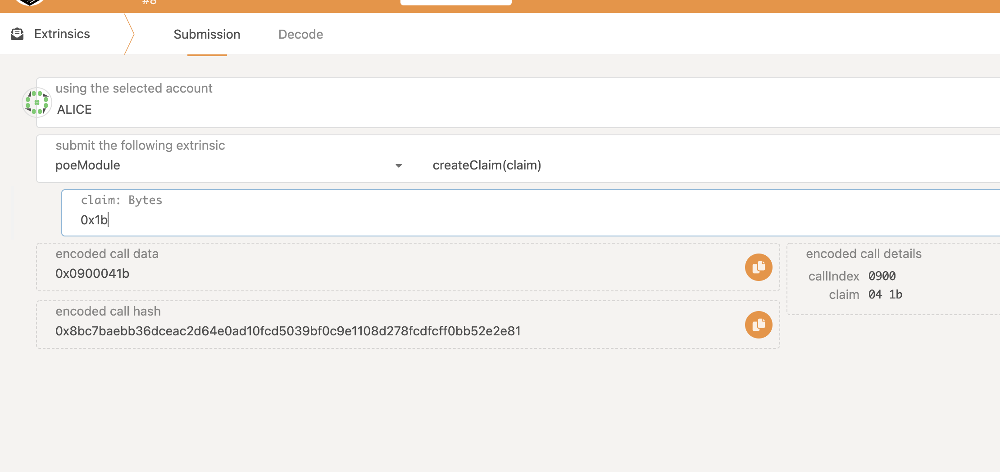

# substrate A work 5th
## 编译注意事项
* 务必注意在pull down这个project后，执行下面的语句
⚠️ cargo update -p parity-db

## 模块说明
我们的模块名是poe(跟着写的)，它的功能包括三个
1. 权证创建
2. 撤销权证
3. 转移权证

## 执行命令
1. cargo build --release (编译)
2. ./target/release/node-template  --dev --tmp (dev mode, 不保存数据)

## 运行截图

